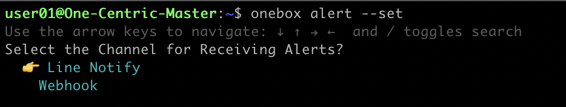
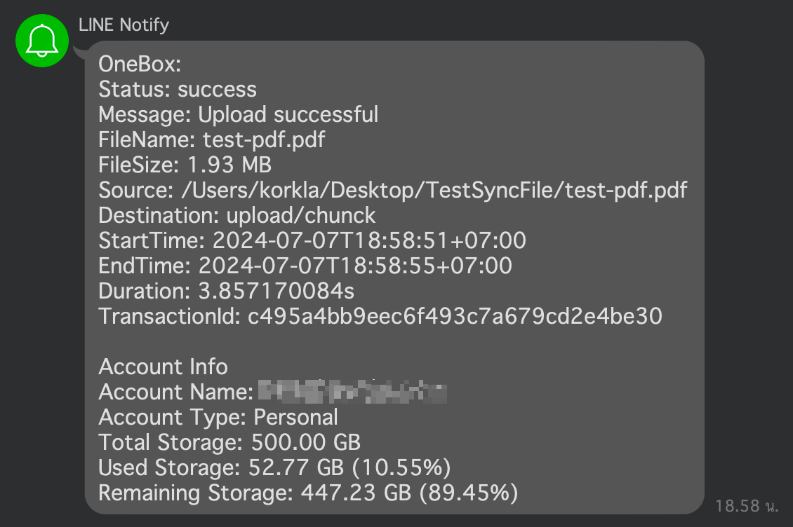

# OneBox CLI

<p align="center">
  
</p>

OneBox CLI เป็น command-line tool ที่ออกแบบมาเพื่ออำนวนความสะดวกในการจัดการไฟล์ และการถ่ายโอนไฟล์ด้วย OneBox คู่มือนี้จะช่วยให้คุณดาวน์โหลด ติดตั้ง และใช้งาน OneBox CLI ได้อย่างมีประสิทธิภาพ

## สารบัญ
- [การติดตั้ง OneBoxCLI บน Linux](#การติดตั้ง-oneboxcli-บน-linux-ubuntu-debian-centos-mac-os)
- [การติดตั้ง OneBoxCLI บน windows](#การติดตั้ง-oneboxcli-บน-windows)
- [การล็อกอิน](#การล็อกอิน)
- [การเลือก Account](#การเลือก-account)
- [อัปโหลดไฟล์](#อัปโหลดไฟล์)
    - [อัปโหลดไฟล์โดยใช้ชื่อไฟล์ต้นฉบับ](#อัปโหลดไฟล์โดยใช้ชื่อไฟล์ต้นฉบับ)
    - [อัปโหลดไฟล์โดยเปลี่ยนชื่อไฟล์ปลายทาง](#อัปโหลดไฟล์โดยเปลี่ยนชื่อไฟล์ปลายทาง)
    - [อัปโหลดไฟล์โดยเปลี่ยนชื่อไฟล์ปลายทางโดยใช้รูปแบบ {datetime}](#อัปโหลดไฟล์โดยเปลี่ยนชื่อไฟล์ปลายทางโดยใช้รูปแบบ-datetime)
- [อัปโหลดโฟลเดอร์](#อัปโหลดโฟลเดอร์)
- [เปิดใช้งานการเก็บ Log](#เปิดใช้งานการเก็บ-Log)
- [การตั้งค่าการแจ้งเตือน](#การตั้งค่าการแจ้งเตือน)
- [การใช้งาน Crontab กับ OneBox](#การใช้งาน-Crontab-กับ-OneBox)


## การติดตั้ง OneBoxCLI บน Linux (ubuntu, debian, centos, mac os)

### 1. ดาวน์โหลดไฟล์ OneBox
```bash
sudo wget https://github.com/onecentric-dev/onebox-cli/releases/latest/download/onebox -O /usr/local/bin/onebox
```

### 2. ให้สิทธิ์ในการรันไฟล์ OneBox
```bash
sudo chmod +x /usr/local/bin/onebox
```

## การติดตั้ง OneBoxCLI บน windows

### 1. download ไฟล์โปรแกรม onebox.exe 

[คลิกเพื่อ download onebox.exe](https://github.com/onecentric-dev/onebox-cli/releases/latest/download/onebox.exe)

### 2. เปิดโฟลเดอร์ที่เก็บไฟล์ onebox.exe


### 3. ที่แถบไดเรกทอรีด้านบน ลบ Path ออก พิมพ์ `cmd` แล้วกดปุ่ม enter


### ตรวจสอบการติดตั้ง

โดยพิมพ์คำสั่ง `onebox version` แล้วกดปุ่ม Enter
```bash
onebox version
```
ถ้าระบบแสดงเลข version ของโปรแกรม หมายถึงระบบทำงานเป็นปกติ การติดตั้งสำเร็จ

## การล็อกอิน

สามารถเข้าสู่ระบบได้ผ่าน 2 ช่องทาง

### 1. เข้าสู่ระบบด้วย Username และ Password OneID:
```bash
onebox login
```


### 2. เข้าสู่ระบบด้วย OneBox Token:
```bash
onebox login-token
```

สามารถหา OneBox Token ได้จากหน้าเว็บ [https://box.one.th](https://box.one.th) หรือ [https://hosbox.id.th](https://hosbox.id.th)

โดยมีขั้นตอนดังนี้

1. หลังจากเข้าสู่ระบบ ให้ไปที่เมนู Profile อยู่มุมขวาบนของหน้าจอ


2. คลิกที่เมนู Onebox token


3. ระบบจะแสดง OneBox Token ให้คัดลอก และนำไปใช้ในการ Login โดย Token จะมีอายุ 5 นาที และใช้ Login ได้ 1 ครั้งต่อ 1 Token เท่านั้น


4. นำ Token ที่คัดลอกจากหน้าเว็บมาใส่ใน OneBox CLI เพื่อ Login


## การเลือก Account

หลังจาก Login กรณีบัญชีของคุณ มีทั้งบัญชีองค์กร และบัญชีส่วนบุคคล คุณจะต้องเลือกบัญชีที่ใช้ในการเก็บข้อมูล


กดปุ่ม Enter เพิ่มเลือก Account


คุณสามารถสลับ Account ได้ตลอดเวลาโดยใช้คำสั่ง
```bash
onebox select-account
```

## อัปโหลดไฟล์

### การใช้งานพารามิเตอร์
- `-s` หรือ `--source` คือ path ไฟล์ในเครื่องที่ต้องการอัปโหลด
- `-d` หรือ `--destination` คือ path ที่ต้องการเก็บไฟล์ใน OneBox

### อัปโหลดไฟล์โดยใช้ชื่อไฟล์ต้นฉบับ
```bash
onebox push -s /path/to/source/file.txt -d /path/to/destination
```


### อัปโหลดไฟล์โดยเปลี่ยนชื่อไฟล์ปลายทาง
```bash
onebox push -s /path/to/source/file.txt -d /path/to/destination/new_file.txt
```

### อัปโหลดไฟล์โดยเปลี่ยนชื่อไฟล์ปลายทางโดยใช้รูปแบบ {datetime}
โดยเพิ่ม `-f` หรือ `--format`
```bash
onebox push -s /path/to/source/file.txt -d /path/to/destination/{datetime}_file.txt -f
```

### รูปแบบของ Format
- `{datetime}`: {ปี}{เดือน}{วัน}_{ชั่วโมง}{นาที}{วินาที} เช่น 20240617_134526
- `{date}`: {ปี}{เดือน}{วัน} เช่น 20240617
- `{time}`: {ชั่วโมง}{นาที}{วินาที} เช่น 134526

### อัปโหลดไฟล์โดยเปลี่ยนชื่อไฟล์ และโฟลเดอร์ปลายทางโดยใช้รูปแบบ {datetime}
```bash
onebox push -s /path/to/source/file.txt -d /path/to/destination-{date}/{time}_file.txt -f
```

## อัปโหลดโฟลเดอร์

### การใช้งานพารามิเตอร์
- `-s` หรือ `--source` คือ path folder ในเครื่องที่ต้องการอัปโหลด
- `-d` หรือ `--destination` คือ path ที่ต้องการเก็บไฟล์ใน OneBox

```bash
onebox push-dir -s /path/to/source -d /path/to/destination
```

ตัวอย่างการใช้งาน


### สามารถกำหนดชื่อ folder ที่ฝั่ง onebox ในรูปแบบ `{datetime}`, `{date}` หรือ `{time}` เหมือนกับการอัปโหลดไฟล์

```bash
onebox push-dir -s /path/to/source -d /path/to/destination-{datetime} -f
```


## เปิดใช้งานการเก็บ Log
สามารถเปิดการใช้งานการเก็บ Log โดยใช้พารามิเตอร์ต่อไปนี้:
- `--log`: เปิดการใช้งานการเก็บ Log
- `--log-file`: Path ที่ต้องการเก็บไฟล์ Log

หากไม่ได้กำหนด `--log-file` Log จะถูกจัดเก็บใน Default Folder ของแต่ละ OS:
- Linux: `/var/log/OneBoxCLI/onebox-cli.log`
- MacOS: `/Library/Logs/OneBoxCLI/onebox-cli.log\`
- Windows: `AppData\OneBoxCLI\logs\onebox-cli.log`

เปิดการใช้งาน log โดยเก็บ log ที่ Default Folder:
```bash
onebox push -s /path/to/source/file.txt -d /path/to/destination --log
```

กำหนด Path สำหรับเก็บ log เอง:
```bash
onebox push -s /path/to/source/file.txt -d /path/to/destination --log --log-file /path/to/save/log
```

กำหนด Path และชื่อไฟล์ log เอง:
```bash
onebox push -s /path/to/source/file.txt -d /path/to/destination --log --log-file /path/to/save/log/mydata.log
```

## การตั้งค่าการแจ้งเตือน
สามารถตั้งค่าให้ส่งแจ้งเตือนไปยัง Line Notify หรือ Webhook เพื่อแจ้งสถานะการ Upload File
```bash
onebox alert --set
```

`Alert ID` คือ id สำหรับอ้างอิงถึง Setting Alert แต่ละอัน ใช้สำหรับอ้างอิงตอนส่ง Alert กรณีต้องการส่งแบบเฉพาะเจาะจง และใช้อ้างอิงสำหรับการลบ Alert

การกำหนด `Alert ID` สามารถใช้ตัวหนังสือเหล่านี้ได้เท่านั้น 0-9, a-z, A-Z, - , _ 

ตัวอย่างการตั้งค่า Alert



การตั้งค่า Line Notify


การตั้งค่า Webhook


สามารถดูการตั้งค่าแจ้งเตือนทั้งหมดโดยใช้คำสั่ง
```bash
onebox alert --list
```

คำสั่งลบการตั้งค่า `--rm` ตามด้วย `alert_id`
```bash
onebox alert --rm {alert_id}
```

การใช้งานเมื่อต้องการส่งแจ้งเตือน โดยจะส่งแจ้งเตือนไปยัง server ทั้งหมดที่ตั้งค่าไว้
```bash
onebox push -s /path/to/source/file.txt -d /path/to/destination --send-alerts
```

กรณีมีการตั้งค่าแจ้งเตือนไว้หลายอัน สามารถเลือกส่งแจ้งเตือนแบบเฉพาะเจาะจงโดยใช้ `alert_id` เป็นตัวกำหนด
```bash
onebox push -s /path/to/source/file.txt -d /path/to/destination --send-alerts --alert-id alertId01,alertId02
```

### ตัวอย่าง Alert ที่ส่งผ่าน Line Notify

กรณี Upload สำเร็จ



กรณี Upload ไม่สำเร็จ

Your space not enough หมายถึงพื้นที่ storage บน OneBox ไม่เพียงพอในการ Upload


### ตัวอย่าง Body Webhook

กรณี Upload สำเร็จ
```json
{
  "status": "success",
  "message": "Upload successful",
  "file_name": "test-pdf.pdf",
  "file_size": "1.93 MB",
  "file_size_byte": 2019837,
  "source": "/Users/korkla/Desktop/TestSyncFile/test-pdf.pdf",
  "destination": "upload/chunck",
  "start_time": "2024-06-24T08:35:14+07:00",
  "end_time": "2024-06-24T08:35:18+07:00",
  "duration": "4.001624584s",
  "transaction_id": "4cb39305903ed94ca6b42d97cad6c547",
  "account_name": "ทดสอบ ระบบ",
  "account_type": "Personal",
  "account_id": "123456708256",
  "total_storage": "500.00 GB",
  "used_storage": "52.76 GB",
  "remaining_storage": "447.24 GB",
  "total_storage_byte": 536870912000,
  "used_storage_byte": 56652495385,
  "remaining_storage_byte": 480218416615
}
```

กรณี Upload ไม่สำเร็จ
```json
{
  "status": "failed",
  "message": "Your space not enough",
  "file_name": "testfile_4GB.zip",
  "file_size": "4.00 GB",
  "file_size_byte": 4294967296,
  "source": "/Users/korkla/Desktop/TestBigFile/file01/testfile_4GB.zip",
  "destination": "upload/chunck",
  "start_time": "2024-06-24T09:34:25+07:00",
  "end_time": "2024-06-24T09:34:26+07:00",
  "duration": "1.067305166s",
  "transaction_id": "",
  "account_name": "ทดสอบ ระบบ",
  "account_type": "Personal",
  "account_id": "123456708256",
  "total_storage": "1.00 GB",
  "used_storage": "1.93 MB",
  "remaining_storage": "1022.07 MB",
  "total_storage_byte": 1073741824,
  "used_storage_byte": 2019837,
  "remaining_storage_byte": 1071721987
}
```

## การใช้งาน Crontab กับ OneBox

### ตัวอย่างตั้งเวลาให้สำรองข้อมูลทุกเที่ยงคืนของทุกวัน
1. เปิดไฟล์ crontab ด้วยคำสั่ง:

```bash
crontab -e
```

2. เพิ่มบรรทัดนี้เข้าไปในไฟล์ crontab:

```bash
0 0 * * * /usr/local/bin/onebox push -s /path/to/source/folder -d /path/to/destination/folder --log --log-file /path/to/save/log/backup.log --send-alerts
```

บรรทัดนี้จะทำให้ระบบสำรองข้อมูลทุกเที่ยงคืนของทุกวันโดยอัตโนมัติ

### สรุปคำสั่งที่ใช้:
- `crontab -e`: เปิดไฟล์ crontab เพื่อแก้ไข
- `0 0 * * *`: ตั้งเวลาให้ทำงานทุกเที่ยงคืนของทุกวัน
- `/usr/local/bin/onebox push -s /path/to/source/folder -d /path/to/destination/folder --log --log-file /path/to/save/log/backup.log --send-alerts`: คำสั่งในการอัปโหลดข้อมูลพร้อมกับเก็บ log และส่งแจ้งเตือน