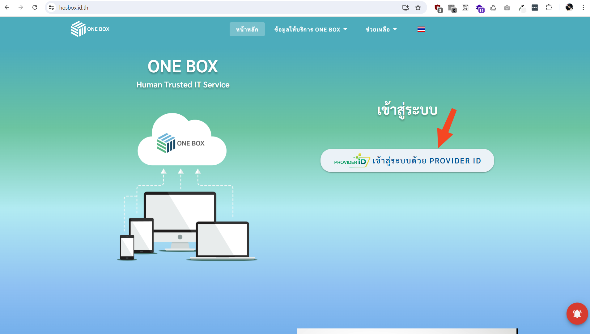
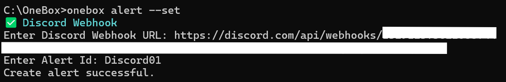
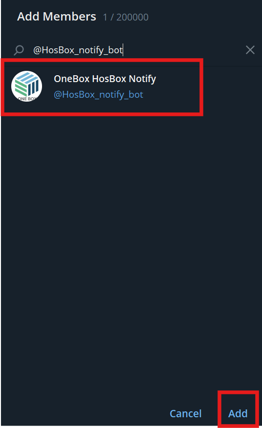
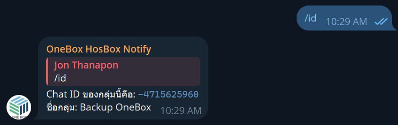

# การตั้งค่า Notify OneBox CLI (เวอร์ชั่น 1.2.2 ขึ้นไป)

## 1. ดาวน์โหลดไฟล์โปรแกรมเวอร์ชั่นล่าสุด

ดาวน์โหลดไฟล์ OneBox สำหรับ Windows

[คลิกเพื่อ download สำหรับ Windows](https://github.com/onecentric-dev/onebox-cli/releases/latest/download/onebox.exe)

ดาวน์โหลดไฟล์ OneBox สำหรับ Linux
```bash
sudo wget https://github.com/onecentric-dev/onebox-cli/releases/latest/download/onebox -O /usr/local/bin/onebox
```

ให้สิทธิ์ในการรันไฟล์ OneBox สำหรับ Linux
```bash
sudo chmod +x /usr/local/bin/onebox
```


## 2. เปิดโฟลเดอร์ที่เก็บไฟล์ onebox.exe เดิม (สำหรับ Windows)


## 3. ลบไฟล์โปรแกรมเดิม แล้วแทนที่ด้วยโปรแกรมเวอร์ชั่นล่าสุด (สำหรับ Windows)


## 4.เปิด command prompt และตรวจสอบเวอร์ชั่นโปรแกรม

```bash
onebox version
```
โปรแกรมต้อง version เท่ากับหรือมากกว่า 1.2.2


## 5.ทำการ Logout และ Login เข้าสู่ระบบ
### 5.1 พิมพ์คำสั่ง logout ลงในหน้าต่าง command prompt
```bash
onebox logout
```
### 5.2 พิมพ์คำสั่ง login-token ลงในหน้าต่าง command prompt เพื่อเข้าสู่ระบบอีกครั้ง
```bash
onebox login-token
```
ระบบจะถามหา token สำหรับใช้ login สามารถหาได้จากเว็บ [https://hosbox.id.th](https://hosbox.id.th/)

 <br>

### 5.3 login เข้าสู่เว็บ [https://hosbox.id.th](https://hosbox.id.th/) ด้วย ProviderID

 <br>


### 5.4 นำ token จากเว็บ hosbox.id.th ไปใช้ในการ login

คลิกที่ชื่อโปรไฟล์มุมขวาบน


คลิกที่ปุ่ม Onebox token


ระบบจะแสดง OneBox Token ให้คัดลอก และนำไปใช้ในการ Login โดย Token จะมีอายุ 5 นาที และใช้ Login ได้ 1 ครั้งต่อ 1 Token เท่านั้น


นำ Token ที่ได้มากรอกใน command prompt แล้วกดปุ่ม enter


ระบบจะแสดงข้อความ Login successful หาก login สำเร็จ


### 5.5 ตรวจสอบข้อมูล Account 

แสดงข้อมูลองค์กร และแสดงข้อมูล Storage คงเหลือในระบบ onebox โดยใช้คำสั่ง

```bash
onebox account-info
```


## 6. ตรวจสอบการตั้งค่า Notify
### 6.1 พิมพ์คำสั่งสำหรับตรวจสอบการตั้งค่า Notify ทั้งหมด
```bash
onebox alert --list
```
ระบบจะแสดง Notify ที่เราตั้งค่าทั้งหมด

 <br>

### 6.2 ลบ Notify ประเภท line-notify ด้วย Alert ID (หากมี)


### 6.3 พิมพ์คำสั่งสำหรับตั้งค่า Notify

```bash
onebox alert --set
```
<br>
Notify ที่เพิ่มมาจะมี Email, Discord Webhook และ Telegram
<br>

<br><br>
Email - กรอก Email ที่ต้องการส่งแจ้งเตือน Backup
<br>

<br><br>
Discord Webhook



#### การสร้างเซิร์ฟเวอร์และขอ Discord Webhook URL

กดเครื่องหมาย `+` สำหรับสร้างกลุ่มสำหรับแจ้งเตือน


กด `สร้างของฉัน`


กด `สำหรับฉันและเพื่อนๆ`


ตั้งชื่อเซิร์ฟเวอร์ แล้วกด `สร้าง` แล้วกด `แก้ไขช่อง`


คลิกขวาช่องข้อความที่ต้องการแจ้งเตือน เช่น `#ทั่วไป` แล้วกด `แก้ไขช่อง`


กด `การรวม` และกด `สร้าง Webhook`


กดที่ตัว bot เพิ่อแสดงรายละเอียด


กด `คัดลอก URL เว็บฮุก` เพื่อนำไปใช้ตั้งค่าการแจ้งเตือน โดย Discord Webhook URL จะขึ้นต้นด้วย `https://discordapp.com/api/webhooks` หรือ `https://discord.com/api/webhooks`


กรอก URL Discord Webhook ที่ต้องการส่งแจ้งเตือน Backup กด enter และตั้ง Alert ID เช่น discord01 แล้วกด enter


<br><br><br>

Telegram - กรอก Chat ID ที่ต้องการส่งแจ้งเตือน Backup


#### การสร้างกลุ่มและขอ Chat ID

เปิดโปรไฟล์แล้วกด `New Group` สำหรับสร้างกลุ่มสำหรับแจ้งเตือน


ตั้งชื่อกลุ่มสำหรับการ backup แล้วกด `Next`


เพิ่ม bot Hos Box Notify โดยพิมพ์ `@HosBox_notify_bot` กดที่ชื่อ bot แล้วกด `Create`



เมื่อกลุ่มถูกสร้างให้พิมพ์ `/id` เพื่อแสดง Chat ID สำหรับนำไปใช้ตั้งค่าการแจ้งเตือน โดยจะขึ้นต้นด้วย - ตามด้วยตัวเลข เช่น `-1234567890`



กรอก Chat ID ที่ต้องการส่งแจ้งเตือน Backup กด enter และตั้ง Alert ID เช่น telegram01 แล้วกด enter


### 6.4 พิมพ์คำสั่งสำหรับตรวจสอบการตั้งค่า Notify ทั้งหมดอีกครั้ง
```bash
onebox alert --list
```


หากข้อมูลถูกต้องแล้วถือว่าการตั้งค่าการแจ้งเตือนเสร็จสิ้น