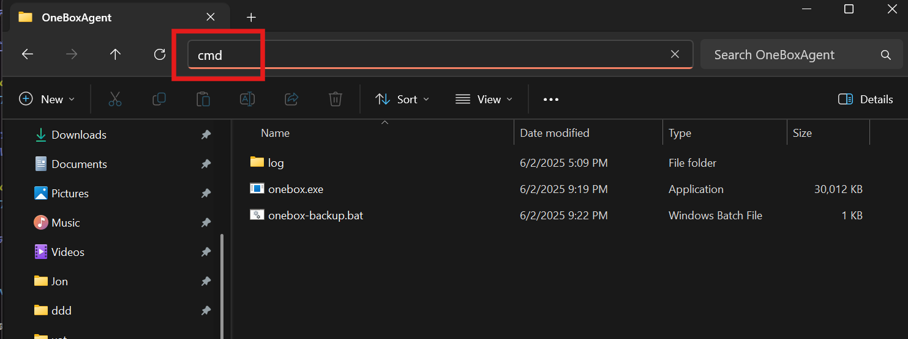
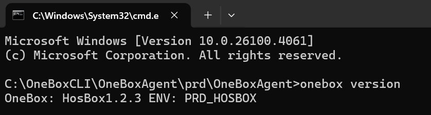
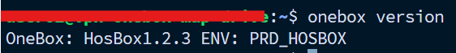

# การตรวจสอบเวอร์ชัน OneBox CLI

## สำหรับ Windows
###  ไปที่โฟลเดอร์ที่เก็บโปรแกรม แล้วเปิด command prompt ด้วยคำสั่ง cmd



### เปิด command prompt และตรวจสอบเวอร์ชันโปรแกรม

```bash
onebox version
```
โปรแกรมต้อง version เท่ากับหรือมากกว่า 1.2.2



## สำหรับ Linux
### เข้าเครื่องที่มีการติดตั้งโปรแกรมและตรวจสอบเวอร์ชัน

```bash
onebox version
```
โปรแกรมต้อง version เท่ากับหรือมากกว่า 1.2.2



<br>

## สำหรับผู้ใช้งานที่ใช้โปรแกรมเวอร์ชัน 1.2.2 ขึ้นไป

ดาวน์โหลดไฟล์ OneBox แล้ววางทับไฟล์โปรแกรมเดิมได้ทันที

สำหรับ Windows

[คลิกเพื่อ download สำหรับ Windows](https://github.com/onecentric-dev/onebox-cli/releases/download/vHosBox1.2.3/onebox.exe)

สำหรับ Linux
```bash
sudo wget https://github.com/onecentric-dev/onebox-cli/releases/download/vHosBox1.2.3/onebox -O /usr/local/bin/onebox
```

ให้สิทธิ์ในการรันไฟล์ OneBox สำหรับ Linux
```bash
sudo chmod +x /usr/local/bin/onebox
```

<br>

## สำหรับผู้ใช้งานที่ใช้โปรแกรมเวอร์ชันต่ำกว่า 1.2.2
กรุณาติดตั้งโปรแกรมใหม่โดยทำตามขั้นตอนในคู่มือการตั้งค่า OneBox CLI ที่ลิงก์ต่อไปนี้:

[การตั้งค่า OneBox CLI](https://github.com/onecentric-dev/onebox-cli/tree/main/alert_backup)