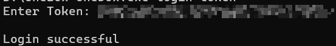
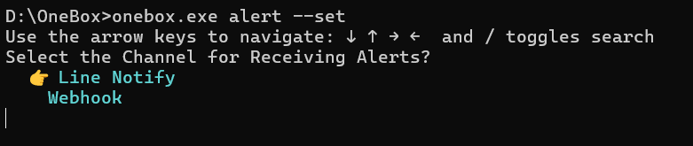
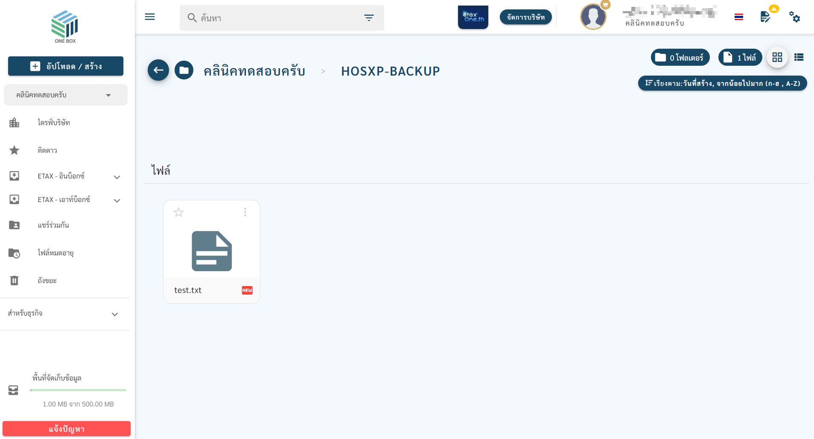

# วิธีใช้งาน OneBox CLI เพื่อสำรองข้อมูลจาก HOSxP

## 1. ดาวน์โหลดไฟล์โปรแกรม onebox.exe และไฟล์ script onebox-backup.bat 

### onebox.exe ไฟล์โปรแกรม

[คลิกเพื่อ download onebox.exe](https://github.com/onecentric-dev/onebox-cli/releases/latest/download/onebox.exe)


### onebox-backup.bat สำหรับเรียกใช้ใน Windows Task Scheduler
[คลิกเพื่อ download onebox-backup.bat](https://github.com/onecentric-dev/onebox-cli/releases/latest/download/onebox-backup.bat)


## 2. เปิดไดเร็คทรอรี ที่เก็บไฟล์ onebox.exe

เพื่อความเป็นระเบียบอาจสร้าง Folder ชื่อ OneBox ไว้เก็บ onebox.exe และ onebox-backup.bat ไว้ที่เดียวกัน


## 3. ที่แถบไดเร็คทรอรีด้านบน ลบ Path ออก พิมพ์ `cmd` แล้วกด enter


## 4. ระบบจะเปิด command prompt ในไดเร็คทรอรีที่เก็บไฟล์ onebox.exe ขึ้นมาให้ ให้ทดสอบโปรแกรมโดยการพิมพ์

```bash
onebox.exe version
```


## 5. Login เข้าสู่ระบบ 
### 5.1 พิมคำสั่ง login token
```bash
onebox.exe login-token
```
ระบบจะถามหา token สำหรับใช้ login สามารถหาได้จากเว็บ [https://hosbox.id.th](https://hosbox.id.th/)

### 5.2 login เข้าสู่เว็บ [https://hosbox.id.th](https://hosbox.id.th/) ด้วย ProviderID

 <br>


### 5.3 นำ token จากเว็บ hosbox.id.th ไปใช้ในการ login

คลิกที่ชื่อโปรไฟล์มุมขวาบน


คลิกที่ปุ่ม Onebox token


ระบบจะแสดง OneBox Token ให้คัดลอก และนำไปใช้ในการ Login โดย Token จะมีอายุ 5 นาที และใช้ Login ได้ 1 ครั้งต่อ 1 Token เท่านั้น


นำ Token ที่ได้มากรอกในโปรแกรม แล้วกดปุ่ม enter


ระบบจะแสดงข้อความ Login successful กรณี login สำเร็จ



### 5.4 ตรวจสอบข้อมูล Account 
```bash
onebox.exe account-info
```
ระบบจะแสดงข้อมูลองค์กร และแสดงข้อมูล Storage คงเหลือในระบบ onebox


## 6. ตั้งค่า Line Alert  (ขั้นตอนนี้สามารถทำในภายหลังได้)
```bash
onebox.exe alert --set
```

เลือกที่ Line Notify แล้วกด enter



กรอกข้อมูล Line Token และ ตั้งค่า Alert ID แล้วกด enter กรณีไม่พบช่องให้กรอก Line Token ให้กดปุ่ม enter อีกครั้ง

`Alert ID` คือ id สำหรับอ้างอิงถึง Setting Alert แต่ละอัน ใช้สำหรับอ้างอิงตอนส่ง Alert กรณีต้องการส่งแบบเฉพาะเจาะจง และใช้อ้างอิงสำหรับการลบ Alert

การกำหนด `Alert ID` สามารถใช้ตัวหนังสือเหล่านี้ได้เท่านั้น 0-9, a-z, A-Z, - , _


[รายละเอียดเพิ่มเติมเกี่ยวกับการตั้งค่า Alert](https://github.com/onecentric-dev/onebox-cli?tab=readme-ov-file#%E0%B8%81%E0%B8%B2%E0%B8%A3%E0%B8%95%E0%B8%B1%E0%B9%89%E0%B8%87%E0%B8%84%E0%B9%88%E0%B8%B2%E0%B8%81%E0%B8%B2%E0%B8%A3%E0%B9%81%E0%B8%88%E0%B9%89%E0%B8%87%E0%B9%80%E0%B8%95%E0%B8%B7%E0%B8%AD%E0%B8%99)

## 7. แก้ไขไฟล์ onebox-backup.bat

### 7.1 เปิดไฟล์ onebox-backup.bat ด้วย notepad


### 7.2 แก้ไข Path ทั้งหมด 4 ส่วน


1. path ที่จัดเก็บไฟล์ onebox.exe

2. path ที่เก็บไฟล์ในเครื่อง

3. path ที่เก็บไฟล์บนระบบ OneBox ส่วนนี้จะเปลี่ยนหรือไม่เปลี่ยนก็ได้ สามารถสร้าง SubFolder ได้ เช่น `HOSxP/backup`<br>
[รายละเอียดเพิ่มเติมเกี่ยวกับการตั้งค่า path บน onebox](https://github.com/onecentric-dev/onebox-cli?tab=readme-ov-file#%E0%B8%AD%E0%B8%B1%E0%B8%9B%E0%B9%82%E0%B8%AB%E0%B8%A5%E0%B8%94%E0%B9%84%E0%B8%9F%E0%B8%A5%E0%B9%8C%E0%B9%82%E0%B8%94%E0%B8%A2%E0%B9%83%E0%B8%8A%E0%B9%89%E0%B8%8A%E0%B8%B7%E0%B9%88%E0%B8%AD%E0%B9%84%E0%B8%9F%E0%B8%A5%E0%B9%8C%E0%B8%95%E0%B9%89%E0%B8%99%E0%B8%89%E0%B8%9A%E0%B8%B1%E0%B8%9A)

4. path สำหรับเก็บ Log

### 7.3 ตั้งค่า Path เพื่อทดสอบ Upload File

7.3.1 สร้าง File ทดสอบด้วย Notepad ในตัวอย่างคือ `test.txt`


7.3.2 ดับเบิ้ลคลิกที่ไฟล์ onebox-backup.bat เพื่อทดสอบการ upload file

 

ระบบจะแสดง Process การ Upload File


ตรวจสอบการ File บนหน้าเว็บ [https://hosbox.id.th](https://hosbox.id.th) 



## 8. ตั้งค่า Path File ที่เก็บไฟล์ Backup ของ HOSxP


จากตัวอย่าง path `D:\BACKUP` เป็นที่เก็บ Folder 1-31 ที่สร้างจากระบบ HOSxP


เมื่อไฟล์ `onebox-backup.bat` ถูกรัน ระบบจะเช็คว่าวันนี้เป็นวันที่เท่าไหร ระบบจะไปเลือก Folder ให้ตรงกับวันปัจจุบัน และค้นหาไฟล์นามสกุล `.7z` ที่ถูกสร้างในวันนี้ 
และ Upload ขึ้นไปยัง OneBox ใน Folder ที่กำหนด

## 9. ตั้งค่า Windows task scheduler เพื่อรัน `onebox-backup.bat` แบบอัตโนมัติ

### 9.1 ค้นหา และเปิดโปรแกรม task scheduler
 <br>

### 9.2 คลิกเลือกเมนู Create Basic Task
 <br>

### 9.3 ตั้งชื่อ Scheduler ใช้เป็นชื่ออะไรก็ได้ หลังจากนั้นกด Next
 <br>

### 9.4 เลือกระยะเวลา Backup เป็น `Daily` แล้วกด Next
 <br>

### 9.5 กำหนดเวลา Backup ควรกำหนดระยะเวลาให้เป็นหลังจากที่ระบบ HOSxP Backup เสร็จ หลังจากนั้นกด Next
 <br>

### 9.6 เลือก Start a program แล้วกด Next
 <br>

### 9.7 เลือกไดเร็คทรอรีเก็บไฟล์ `onebox-backup.bat` หลังจากนั้นกด Next
 <br>

### 9.8 กดที่ปุ่ม Finish
 <br>


